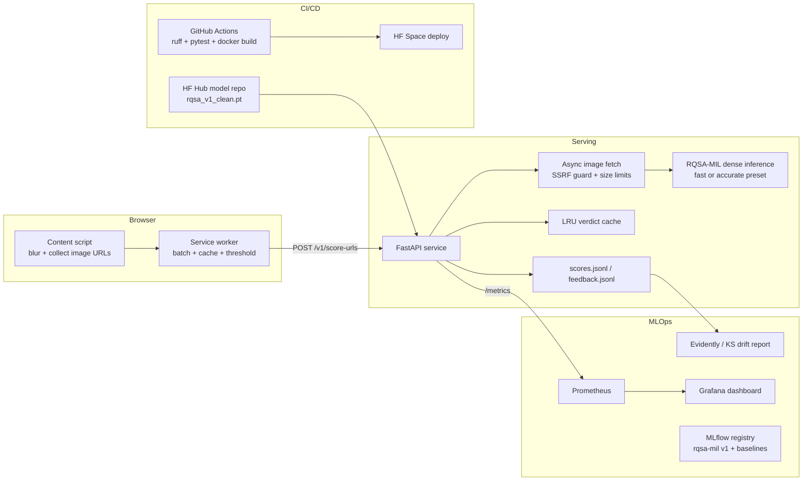

# SafeSight architecture

## Request path (extension)

1. Content script finds `` elements at least 80px on the short side,
   applies a blur immediately, and debounces URLs into 300ms batches.
2. The service worker checks its `chrome.storage` verdict cache, then calls
   `POST /v1/score-urls` for the misses.
3. The API fetches uncached URLs concurrently (bounded semaphore) through
   the SSRF-hardened fetcher: public hosts only with every redirect hop
   re-validated, image content types only, streamed with a hard byte cap.
   Each image is then scored by the configured strategy (cascade by
   default): short side normalized to 690px, windows slid at training
   scale, per-tier top-3 means aggregated into a verdict.
4. The worker applies the user's sensitivity threshold to `score_large` and
   answers the content script, which unblurs safe images and badges NSFW ones.
5. Revealing a flagged image posts a correction to `/v1/feedback`, feeding
   the labeled retraining queue.

## Design decisions

- **Two presets.** The paper's evaluation settings (`accurate`: 3 large window
  tiers + small tier, flip TTA, soft-NMS) cost hundreds of patches per image.
  The `fast` preset (single 265px tier, no TTA) cuts patches for interactive
  extension latency on CPU-only hosting.
  **Correction**: earlier draft claimed this cuts patches "roughly 8x"; the
  measured patch counts in `docs/benchmarks.md` show fast vs. accurate at
  24 vs. 340 (medium, ~14x) and 30 vs. 464 (large, ~15.5x) — closer to
  12-15x than 8x on realistic image sizes.
- **Clean checkpoint format.** The research checkpoint pickled a training
  Config object, forcing `weights_only=False`. It is converted once to a
  tensors-only file that loads with `weights_only=True`.
- **URL-based scoring.** The extension sends URLs, not pixels: smaller
  requests, server-side caching by URL hash, and no user-rendered content
  leaves the browser beyond addresses already visible in page source.
- **Fail open.** If the API is unreachable, the extension unblurs rather than
  breaking the page; protection status is visible in the popup.
